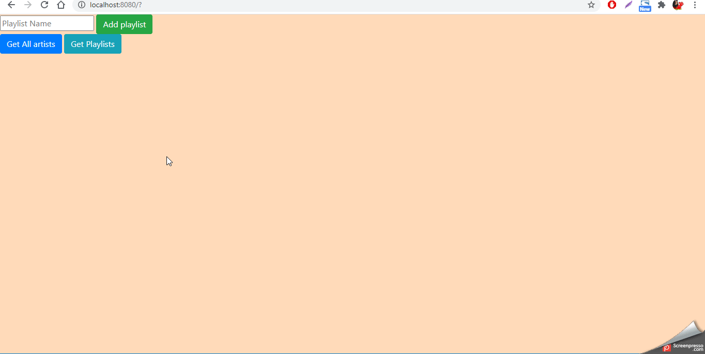

# The Musicker

## Description:

This project consists of an app where the user can see a list of artists, the albums of each artist and the songs that belong to each album. Furthermore, the user can view a list of Playlists, add a new playlist or delete an existing one.

## Demo:

## Objective:

Practice with databases and SQL queries.

## Features:

- See the list of artists.
- See the album of every artist.
- See the songs that belong to each album
- See the songs that belong to each artist.
- See the playlists.
- See the songs that belong to each playlist.
- Add a Playlist.
- Delete a Playlist.

## Technologies:

- HTML5
- Javascript
- Node
- Express
- SQLite
- Chinook Database
- Bootstrap

## Status:

- In progress.

## Credits:

- Alejandro - [@AlejoVE](https://github.com/AlejoVE) [Twitter](https://twitter.com/AlejoVE_)
- [Hack Your Future Belgium](https://hackyourfuture.be/)

### 
